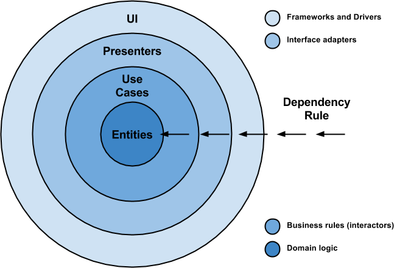

### About the project

This project has beed developed as a technical test for [TuLotero](https://tulotero.es).

This project implements [Clean Architecture](https://8thlight.com/blog/uncle-bob/2012/08/13/the-clean-architecture.html) using model view presenter as its main design patter. This layers are strongly delimited following the dependency rule.  

### Features
- In order to follow the dependency inversion principle, the project is using [Dagger 2](https://dagger.dev/) to implement the dependency inyection.
- The requests have been implemented using [Retrofit 2](http://square.github.io/retrofit/) with asynchronous calls.
- Remote pictures are managed using [Picasso](https://square.github.io/picasso/) library.
- There are three UI tests as examples in the class "MainActivityTest".